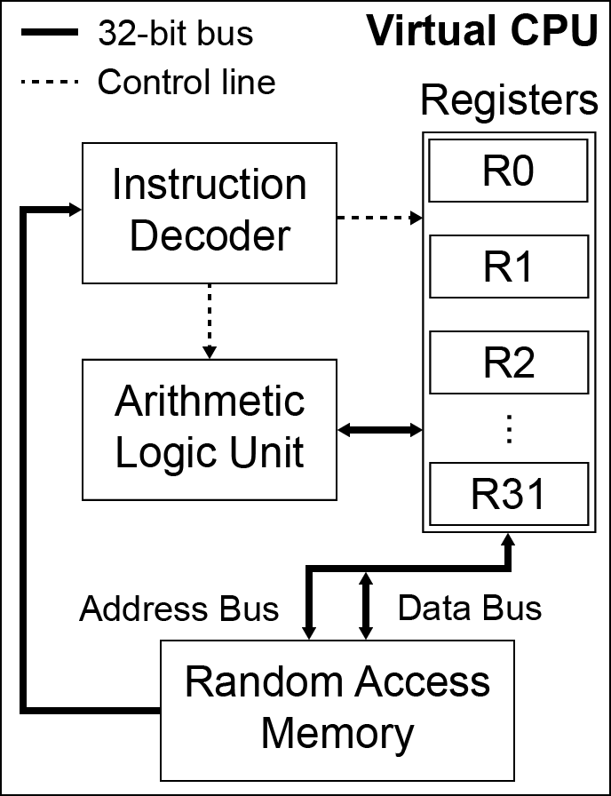
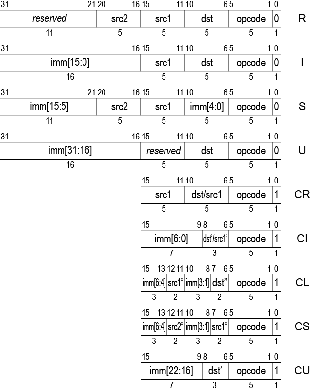

SVM
===

Simple Virtual Machine
By James Chapman (jchapman3000@gmail.com)

Revision v0.1.0

About
-----

SVM aims to be a low-level virtual machine that is both fast and has minimal resource consumption.

Table of Contents
-----------------

1. [Registers](#registers)
2. [Instructions](#instructions)
    1. [R-Type Instructions](#r-type-instructions)
    2. [I-Type Instructions](#i-type-instructions)
    3. [S-Type Instructions](#s-type-instructions)
    4. [U-Type Instructions](#u-type-instructions)
    5. [CR-Type Instructions](#cr-type-instructions)
    6. [CI-Type Instructions](#ci-type-instructions)
    7. [CL-Type Instructions](#cl-type-instructions)
    8. [CS-Type Instructions](#cs-type-instructions)
    9. [CU-Type Instructions](#cu-type-instructions)
    10. [System Instructions](#system-instructions)
3. [Syscalls](#syscalls)
4. [Exceptions](#exceptions)
5. [Software Calling Convention](#software-calling-convention)

Architecture
------------

SVM is defined as a 32-bit, register-based, load-store (RISC) architecture.
Addresses, registers and instructions[^1] are all one word (4 bytes or 32-bits) in size.

[^1]: See also [compressed instructions](#compressed-instructions).

Registers
---------

There are 32 registers that hold integer values, `r0`-`r31`, which are user-visible. Register `r0` is hardwired to the program counter and while no stack specific instructions currently exist, register `r1` is reserved as the stack pointer and should be initialised with the value `0xfffffffc` on reset.

The remaining registers are general-purpose, however the reader should refer to the [software calling convention](#software-calling-convention) section for more information on the registers used by the convention.

Instructions
------------

The SVM instruction set consists of four 32-bit instruction types (R, I, S, U) and five 16-bit 'compressed' instruction types (CR, CI, CL, CS, CU), shown below.

The available standard instructions are:

##### R-Type Instructions

| Opcode | Instruction | Comment |
| ------ | ----------- | ----------- |
| 0x02 | ADD *dst*, *src1*, *src2* | N/A |
| 0x04 | SUB *dst*, *src1*, *src2* | N/A |
| 0x06 | AND *dst*, *src1*, *src2* | N/A |
| 0x08 | OR *dst*, *src1*, *src2* | N/A |
| 0x0a | XOR *dst*, *src1*, *src2* | N/A |
| 0x0c | SLL *dst*, *src1*, *src2* | Logical shift left by (*src2* & 0x1f) |
| 0x0e | SRL *dst*, *src1*, *src2* | Logical shift right by (*src2* & 0x1f) |
| 0x10 | SRA *dst*, *src1*, *src2* | Arithmetic shift right by (*src2* & 0x1f) |

##### I-Type Instructions

I-Type immediates are sign extended to 32-bits.

| Opcode | Instruction | Comment |
| ------ | ----------- | ------- |
| 0x12 | ADDI *dst*, *src1*, *imm* | N/A |
| 0x14 | ANDI *dst*, *src1*, *imm* | N/A |
| 0x16 | ORI *dst*, *src1*, *imm* | N/A |
| 0x18 | XORI *dst*, *src1*, *imm* | N/A |
| 0x1a | SLLI *dst*, *src1*, *imm* | Logical shift left by (*imm* & 0x1f) |
| 0x1c | SRLI *dst*, *src1*, *imm* | Logical shift right by (*imm* & 0x1f) |
| 0x1e | SRAI *dst*, *src1*, *imm* | Arithmetic shift right by (*imm* & 0x1f) |
| 0x20 | BEZ *src1*, *imm* | Branch if *src1* == 0 with offset *imm* |
| 0x22 | BNZ *src1*, *imm* | Branch if *src1* != 0 with offset *imm* |
| 0x30 | LI *dst*, *imm* | Load *imm* into *dst* |
| 0x34 | LOAD *dst*, *src1*, *imm* | Load from memory address (*src1* + *imm*) into *dst* |

##### S-Type Instructions

S-Type immediates are sign extended to 32-bits.

| Opcode | Instruction | Comment |
| ------ | ----------- | ------- |
| 0x24 | BEQ *src1*, *src2*, *imm* | Branch if *src1* == *src2* with offset *imm* |
| 0x26 | BNE *src1*, *src2*, *imm* | Branch if *src1* != *src2* with offset *imm* |
| 0x28 | BLT *src1*, *src2*, *imm* | Branch if *src1* < *src2* with offset *imm*. Treats operands as signed |
| 0x2a | BGE *src1*, *src2*, *imm* | Branch if *src1* >= *src2* with offset *imm*. Treats operands as signed |
| 0x2c | BLT.U *src1*, *src2*, *imm* | Branch if *src1* < *src2* with offset *imm*. Treats operands as unsigned |
| 0x2e | BGE.U *src1*, *src2*, *imm* | Branch if *src1* >= *src2* with offset *imm*. Treats operands as unsigned |
| 0x36 | STORE *src1*, *src2*, *imm* | Store into memory address (*src2* + *imm*) from *src1* |

##### U-Type Instructions

| Opcode | Instruction | Comment |
| ------ | ----------- | ------- |
| 0x32 | LUI *dst*, *imm* | Load *imm* into the upper half of *dst*, clearing lower half bits

#### Compressed Instructions

'Compressed' instructions are 16-bits wide and allow for greater code density to be achieved in cases where small immediate values are used or access to only a subset of the register file (e.g. `r0`-`r7`) is required.

The available compressed instructions are:

##### CR-Type Instructions

| Opcode | Instruction | Comment |
| ------ | ----------- | ----------- |
| 0x03 | C.ADD *dst/src1*, *src2* | N/A |
| 0x05 | C.SUB *dst/src1*, *src2* | N/A |
| 0x07 | C.AND *dst/src1*, *src2* | N/A |
| 0x09 | C.OR *dst/src1*, *src2* | N/A |
| 0x0b | C.XOR *dst/src1*, *src2* | N/A |
| 0x0d | C.SLL *dst/src1*, *src2* | Logical shift left by (*src2* & 0x1f) |
| 0x0f | C.SRL *dst/src1*, *src2* | Logical shift right by (*src2* & 0x1f) |
| 0x11 | C.SRA *dst/src1*, *src2* | Arithmetic shift right by (*src2* & 0x1f) |
| 0x39 | MV *dst* *src2* | N/A |

##### CI-Type Instructions

CI-Type immediates are sign extended to 32-bits.

| Opcode | Instruction | Comment |
| ------ | ----------- | ------- |
| 0x13 | C.ADDI *dst'/src1'*, *imm* | N/A |
| 0x15 | C.ANDI *dst'/src1'*, *imm* | N/A |
| 0x17 | C.ORI *dst'/src1'*, *imm* | N/A |
| 0x19 | C.XORI *dst'/src1'*, *imm* | N/A |
| 0x1b | C.SLLI *dst'/src1'*, *imm* | Logical shift left by (*imm* & 0x1f) |
| 0x1d | C.SRLI *dst'/src1'*, *imm* | Logical shift right by (*imm* & 0x1f) |
| 0x1f | C.SRAI *dst'/src1'*, *imm* | Arithmetic shift right by (*imm* & 0x1f) |
| 0x21 | C.BEZ *src1'*, *imm* | Branch if *src1'* == 0 with offset *imm* |
| 0x23 | C.BNZ *src1'*, *imm* | Branch if *src1'* != 0 with offset *imm* |
| 0x31 | C.LI *dst'*, *imm* | Load *imm* into *dst'* |

##### CL-Type Instructions

CL-Type immediates are sign extended to 32-bits.

| Opcode | Instruction | Comment |
| ------ | ----------- | ------- |
| 0x35 | C.LOAD *dst"*, *src1"*, *imm* | Load from memory address (*src1"* + *imm*) into *dst"* |

##### CS-Type Instructions

CS-Type immediates are sign extended to 32-bits.

| Opcode | Instruction | Comment |
| ------ | ----------- | ------- |
| 0x37 | C.STORE *src1"*, *src2"*, *imm* | Store into memory address (*src2"* + *imm*) from *src1"* |

##### CU-Type Instructions

CU-Type immediates are sign extended to 32-bits.

| Opcode | Instruction | Comment |
| ------ | ----------- | ------- |
| 0x33 | C.LUI *dst'*, *imm* | Load *imm* into the upper half of *dst'*, clearing lower half bits

##### System Instructions

There are two types of system instructions:

| Opcode | Instruction | Comment |
| ------ | ----------- | ------- |
| 0x3c | CALL *imm* | Call syscall #*imm* |
| 0x3e | BREAK | Trigger breakpoint if supported by implementation and breakpoints are enabled |
| 0x3d | C.CALL *imm* | Call syscall #*imm* |
| 0x3f | C.BREAK | Trigger breakpoint if supported by implementation and breakpoints are enabled |

Syscalls
--------

The available syscalls are:

| #No. | Name | `r4` | `r5` | `r6` | `r7` | `r3` |
| ---- | ---- | ---- | ---- | ---- | ---- | ---- |
| 0 | sys_exit | status_code | N/A | N/A | N/A | N/A |
| 1 | sys_read | file_handle | pointer | length | N/A | count |
| 2 | sys_write | file_handle | pointer | length | N/A | count |
| 3 | sys_open | pointer | length | flags | N/A | file_handle |
| 4 | sys_close | file_handle | N/A | N/A | N/A | status_code |
| 5 | sys_create | pointer | length | N/A | N/A | file_handle |

Where the valid file flags are:

| Value | Name |
| ----- | ---- |
| 1 | READ |
| 2 | WRITE |
| 4 | CREATE |
| 8 | EXCLUSIVE |
| 16 | TRUNCATE |
| 32 | APPEND |

Exceptions
----------

At this time, SVM does not define any way to catch or handle triggered exceptions within the VM itself. Any errors encountered during execution, such as an invalid operation, should cause the VM to halt and the process to exit.

An implementation may contain a mechanism to retrieve or display information about the exception, however this behaviour is implementation defined and not guaranteed.

Software Calling Convention
---------------------------

The advocated software calling convention is as follows: the first four arguments are stored in registers `r4`-`r7`, any remaining arguments should be pushed onto the stack, leftmost argument first. The return address is stored in `r2` and `r3` is used to store the return value.

All other registers should be considered volatile and saved to the stack by the caller before transferring control to the callee.
